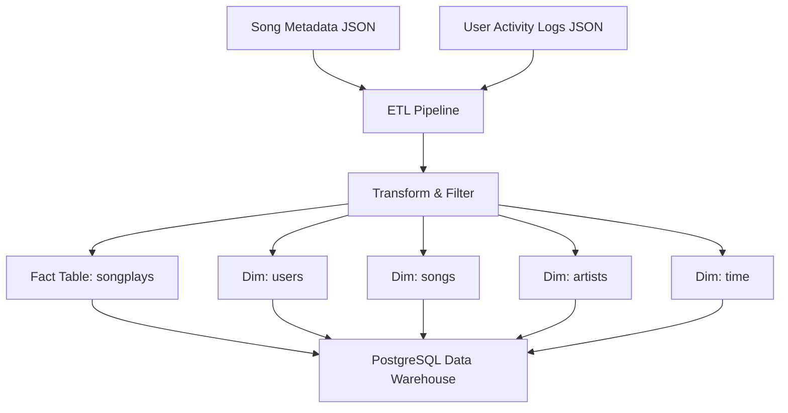

# Music Streaming Analytics Data Pipeline

A data engineering pipeline that processes raw event logs and song metadata to build an analytics-ready PostgreSQL data warehouse. The system ingests semi-structured JSON data, transforms it into structured relational tables, and enables efficient analysis of user listening behavior and music streaming activity.

The pipeline demonstrates core data engineering concepts including ETL workflows, dimensional data modeling, and automated database population using Python and PostgreSQL.

---

## Problem

Modern streaming platforms generate large volumes of event data that are difficult to analyze directly due to their semi-structured format. Product teams, analysts, and recommendation systems require clean, structured data to understand user listening behavior, track song popularity, and measure platform engagement.

Raw event logs alone are not suitable for analytics because they lack structure, normalization, and efficient query paths.

---

## Solution

This system builds an automated ETL pipeline that ingests raw JSON log files and song metadata, transforms the data into a structured format, and loads it into a PostgreSQL analytical database using a star schema.

The pipeline performs the following operations:

- Extracts song metadata and user activity logs from JSON files
- Transforms timestamps, filters relevant events, and normalizes records
- Loads the processed data into dimension and fact tables designed for analytical queries

The resulting database enables efficient analysis of user listening patterns, artist popularity, and streaming trends.

---

## System Architecture



### Key Components

| Component | Description |
|---|---|
| **Data Sources** | Song metadata and user activity logs stored as JSON files |
| **ETL Pipeline** | Python-based pipeline that extracts, transforms, and loads data |
| **Data Warehouse** | PostgreSQL star schema optimized for analytical queries |
| **SQL Layer** | Centralized query management via `sql_queries.py` |

### Star Schema

**Fact Table**
- `songplays` — records of individual song play events

**Dimension Tables**
- `users` — user profile and subscription information
- `songs` — song metadata
- `artists` — artist metadata
- `time` — structured timestamp attributes derived from play events

---

## Technologies Used

- Python
- PostgreSQL
- Pandas
- psycopg2
- SQL
- JSON Data Processing

---

## Project Structure

```
music-streaming-pipeline/
├── etl.py              # Main ETL pipeline execution
├── create_tables.py    # Database and table initialization
├── sql_queries.py      # Centralized SQL logic (DDL + DML)
├── data/
│   ├── song_data/      # Song metadata JSON files
│   └── log_data/       # User activity log JSON files
└── README.md
```

---

## Example Usage

**1. Create database tables:**

```bash
python create_tables.py
```

Initializes the PostgreSQL database and creates the required fact and dimension tables.

**2. Run the ETL pipeline:**

```bash
python etl.py
```

The pipeline will process song metadata files, process user activity logs, and load transformed data into PostgreSQL.

**3. Query the analytics database:**

```sql
SELECT
    u.level,
    COUNT(*) AS total_streams
FROM songplays s
JOIN users u ON s.user_id = u.user_id
GROUP BY u.level;
```

This query analyzes listening activity across subscription tiers.

---

## Key Features

- Star schema data warehouse optimized for analytical queries
- Automated ETL pipeline built with Python
- Structured transformation of semi-structured JSON data
- Centralized SQL query management via `sql_queries.py`
- Timestamp processing and time dimension generation
- Efficient ingestion of large log datasets

---

## Future Improvements

- **Workflow Orchestration** — Schedule and monitor ETL jobs with Apache Airflow or Prefect
- **Data Validation** — Implement quality checks using Great Expectations
- **Incremental Processing** — Add logic to process only newly arrived data
- **Cloud Deployment** — Migrate to AWS S3 (storage), AWS RDS or Snowflake (warehouse), Docker (containerization)
- **Streaming Pipeline** — Extend architecture for real-time ingestion using Kafka or Kinesis
